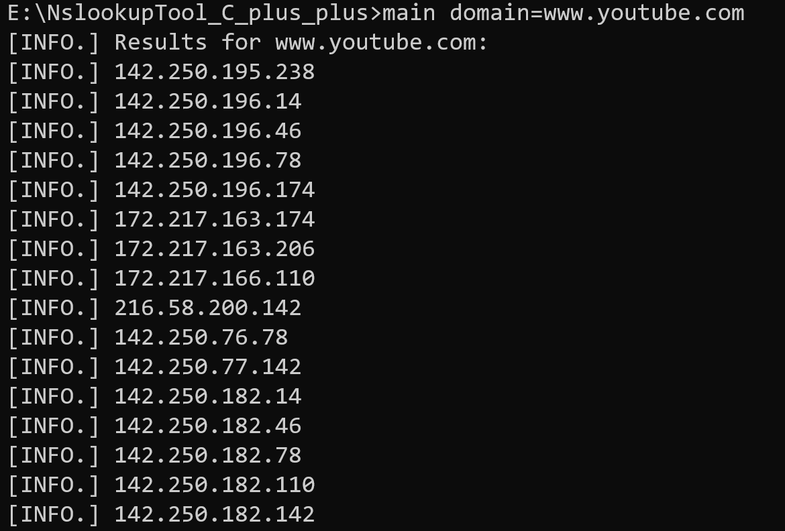
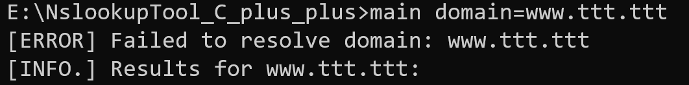
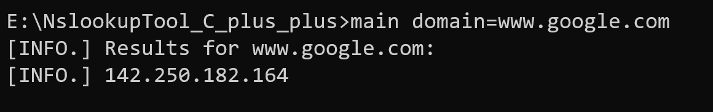
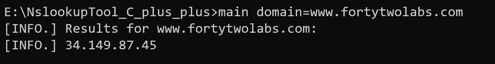

# DNS Lookup Tool (C++)

This project is a C++ DNS Lookup Tool that resolves domain names to their respective IP addresses using the Winsock API for DNS resolution. It also supports logging the results and handling domain input through command-line arguments.

## Table of Contents

- [Requirements](#requirements)
- [Setup](#setup)
- [Usage](#usage)
- [Screenshot](#screenshot)

## Requirements

Before compiling and running the program, ensure the following are installed on your Windows machine:

- **g++ (MinGW)**: You can download MinGW from [here](https://osdn.net/projects/mingw/releases/).
- **Winsock2 library**: This is required for DNS resolution using the `getaddrinfo` function.

## Setup

1. **Clone the repository**:
   Open your command line (CMD or PowerShell) and run the following command to clone the repository:
   
   ```bash
   git clone https://github.com/suraj-d-sun//dns-lookup-tool.git
   cd dns-lookup-tool

2. **Navigate to the source folder**: 
    Change the directory to where the source files (.cpp and .h files) are located:
    ```bash
    cd src

3. **Compile the .cpp files**: Run the following commands to compile the .cpp files into object files:
    ```bash
    g++ -c ConfigManager.cpp -I ..\include -o ConfigManager.o
    g++ -c DNSResolver.cpp -I ..\include -o DNSResolver.o
    g++ -c Logger.cpp -I ..\include -o Logger.o

4. **Create the static library**: After compiling the object files, run this command to create the static library file:
    ```bash
    ar rcs lib.lib *.o

5. **Move the lib file to the lib directory**: Move the generated lib.lib file to the lib directory:
    ```bash
    move lib.lib ..\lib

6. **Compile the main program**: Now, compile the main.cpp file along with the static library and the Winsock library:
    ```bash
    g++ main.cpp -I .\include -L .\lib -llib -o main.exe -lws2_32


## Usage
1. **Run the Program**: Once the executable (main.exe) is created, you can run the program from the command line.
    ```bash
    main domain=www.youtube.com
The program will resolve the domain www.youtube.com and display its associated IP addresses.

2. **Output Example**: After running the command, you should see output like this:
    ```bash
    [INFO.] Results for www.youtube.com:
    [INFO.] 142.250.195.238
    [INFO.] 142.250.196.14
    [INFO.] 142.250.196.46
    [INFO.] 142.250.196.78
    [INFO.] 142.250.196.174
    [INFO.] 172.217.163.174
    [INFO.] 172.217.163.206
    [INFO.] 172.217.166.110
    [INFO.] 216.58.200.142
    [INFO.] 142.250.76.78
    [INFO.] 142.250.77.142
    [INFO.] 142.250.182.14
    [INFO.] 142.250.182.46
    [INFO.] 142.250.182.78
    [INFO.] 142.250.182.110
    [INFO.] 142.250.182.142

# Screenshot
Below is a screenshot showing the command-line output of the program when resolving the domains.







